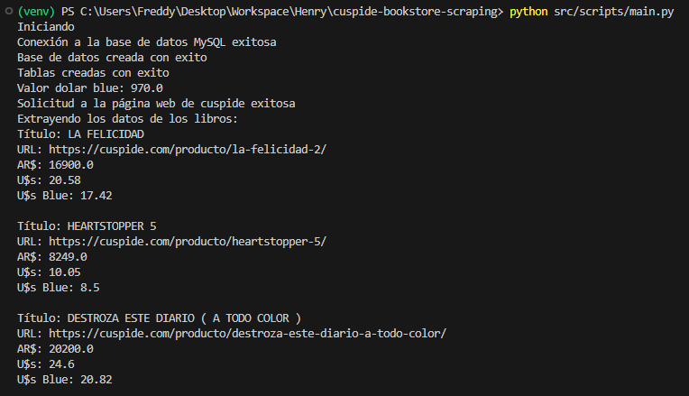
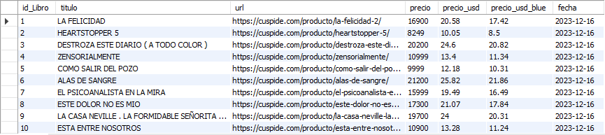
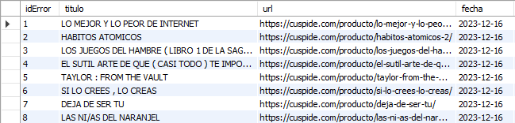

<a name="readme-top"></a>

<!-- PROJECT SHIELDS -->

[![Contributors][contributors-shield]][contributors-url]
[![Forks][forks-shield]][forks-url]
[![Stargazers][stars-shield]][stars-url]
[![Issues][issues-shield]][issues-url]
[![MIT Licencia][Licencia-shield]][Licencia-url]
[![LinkedIn][linkedin-shield]][linkedin-url]

<!-- PROJECT LOGO -->
<br />
<div align="center">
  <a href="https://www.cuspide.com">
    
    
  </a>

<h3 align="center">Scraping Cuspide's Bookstore Website</h3>

  <p align="center">
    <br />
    <a href="https://github.com/FreddyPinto/cuspide-bookstore-scraping"><strong>Explorar docs »</strong></a>
    <br />
    <br />
    <a href="https://github.com/FreddyPinto/cuspide-bookstore-scraping/issues">Reportar Bug</a>
    ·
    <a href="https://github.com/FreddyPinto/cuspide-bookstore-scraping/issues">Request Feature</a>
  </p>
</div>

<!-- Tabla de contenido -->
<details>
  <summary>Tabla de contenido</summary>
  <ol>
    <li>
      <a href="#acerca-del-proyecto">Acerca del Proyecto</a>
      <ul>
        <li><a href="#desarrollado-con">Desarrollado con:</a></li>
      </ul>
    </li>
    <li>
      <a href="#getting-started">Getting Started</a>
      <ul>
            <li><a href="#instalación">Instalación</a></li>
      </ul>
    </li>
    <li><a href="#uso">Uso</a></li>
    <li><a href="#roadmap">Roadmap</a></li>
    <li><a href="#contribuciones">Contribuciones</a></li>
    <li><a href="#licencia">Licencia</a></li>
    <li><a href="#contacto">Contacto</a></li>
  </ol>
</details>

<!-- Acerca del Proyecto -->

## Acerca del Proyecto

<p align="center">
  
</p>

Este proyecto realiza web scraping en la página web de [Cúspide Libros](https://www.cuspide.com) para obtener el listado de los 100 libros más vendidos de la semana. Los datos recopilados incluyen el título del libro, la URL del libro, el precio en pesos, el precio en dólares y el precio en dólares considerando la cotización del dólar blue de Argentina. Los datos se almacenan en una base de datos MySQL. Este proyecto se desarrolló como parte del [Proyecto Integrador](references/ejercicio_integrador.pdf) correspondiente al Módulo 3 del bootcamp en Data Science de [SoyHenry](https://www.soyhenry.com/).

<p align="right">(<a href="#readme-top">volver arriba</a>)</p>

### Desarrollado con:

- [![Python][Python]][Python-url]
- [![Pandas][Pandas]][Pandas-url]
- [![MySQL][MySQL]][MySQL-url]
- [![Jupiter][Jupiter]][Jupiter-url]
- [![VSC][VSC]][VSC-url]
- [![BeautifulSoup][BeautifulSoup]][BeautifulSoup-url]

<p align="right">(<a href="#readme-top">volver arriba</a>)</p>

<!-- GETTING STARTED -->

## Getting Started

Para ejecutar este proyecto localmente sigue estos pasos para configurarlo:

### Instalación

1. Clona el repositorio:
   ```sh
   git clone https://github.com/FreddyPinto/cuspide-bookstore-scraping.git
   ```
2. Crea un entorno virtual de Python:
   ```sh
   python -m venv venv
   ```
3. Activa el entorno virtual:
   - En Windows:
     ```sh
     .\env\Scripts\activate
     ```
   - Unix o MacOS:
     ```sh
     env/bin/activate
     ```
4. Instala las dependencias:
   ```sh
   pip install -r requirements.txt
   ```
5. Crea un archivo `.env` en el directorio raíz del proyecto y añade las siguientes variables de entorno:
    ```sh
    DB_HOST=tu_host
    DB_PORT=tu_puerto
    DB_USERNAME=tu_usuario
    DB_PASSWORD=tu_contraseña
    ```
<p align="right">(<a href="#readme-top">volver arriba</a>)</p>

<!-- USAGE EXAMPLES -->

## Uso

Para ejecutar el script de web scraping, usa el siguiente comando:

```
python src/scripts/main.py
```

Esto realizara el scraping de la página web de [Cúspide Libros](https://www.cuspide.com), obtendra los datos de los 100 libros más vendidos de la semana y los almacenara en una base de datos MySQL.
<figure align="center">
  
  <figcaption>Tabla books</figcaption>
</figure>

<figure align="center">
  
  <figcaption>Tabla errors</figcaption>
</figure>

<p align="right">(<a href="#readme-top">volver arriba</a>)</p>

<!-- ROADMAP -->

## Roadmap

Este proyecto se realizó como un Producto Mínimo Viable, por lo que se podrían mejorar algunos aspectos en el futuro, con la finalidad de lograr un producto más completo y robusto. Algunas de las posibles mejoras son:

- [ ] Mejorar la eficiencia del web scraping, explorando técnicas para acelerar la extracción de datos.

- [ ] Implementar un manejo de errores más robusto para manejar posibles fallos durante el web scraping.

- [ ] Implementar pruebas automatizadas para asegurar que el código funciona como se espera después de cada cambio.

- [ ] Explorar otras bibliotecas o herramientas para el web scraping que podrían ofrecer mejores prestaciones o facilidades de uso.

- [ ] Mejorar la documentación del proyecto, incluyendo más detalles sobre cómo se realiza el web scraping y cómo se pueden utilizar los datos extraídos.

Consulta los [issues abiertos](https://github.com/FreddyPinto/cuspide-bookstore-scraping/issues) para proponer características (y problemas conocidos).

<p align="right">(<a href="#readme-top">volver arriba</a>)</p>

<!-- CONTRIBUTING -->

## Contribuciones

Las contribuciones son lo que hacen que la comunidad de código abierto sea un lugar increíble para aprender, inspirarse y crear. Cualquier contribución que hagas será **muy apreciada**.

Si tienes una sugerencia para mejorar este proyecto, haz un fork del repositorio y crea un pull request. También puedes simplemente abrir un issue con la etiqueta _“enhancement”_. ¡No olvides darle una estrella al proyecto! Gracias de nuevo.

1. Haz un fork del Proyecto
2. Crea tu feature Branch (`git checkout -b feature/AmazingFeature`)
3. Haz commit de tus cambios (`git commit -m 'Add some AmazingFeature'`)
4. Push a la Branch (`git push origin feature/AmazingFeature`)
5. Abre un Pull Request

<p align="right">(<a href="#readme-top">volver arriba</a>)</p>

<!-- Licencia -->

## Licencia

Distribuido bajo la licencia MIT. Consulta el archivo [LICENSE](LICENSE) para más información.

<p align="right">(<a href="#readme-top">volver arriba</a>)</p>

<!-- Contacto -->

## Contacto

Freddy Pinto - [freddypinto@outlook.com](mailto:freddypinto@outlook.com)

[![LinkedIn][linkedin-shield]][linkedin-url]

<p align="right">(<a href="#readme-top">volver arriba</a>)</p>

<!-- MARKDOWN LINKS & IMAGES -->
<!-- https://www.markdownguide.org/basic-syntax/#reference-style-links -->

[contributors-shield]: https://img.shields.io/github/contributors/FreddyPinto/cuspide-bookstore-scraping.svg?style=for-the-badge
[contributors-url]: https://github.com/FreddyPinto/cuspide-bookstore-scraping/graphs/contributors
[forks-shield]: https://img.shields.io/github/forks/FreddyPinto/cuspide-bookstore-scraping.svg?style=for-the-badge
[forks-url]: https://github.com/FreddyPinto/cuspide-bookstore-scraping/network/members
[stars-shield]: https://img.shields.io/github/stars/FreddyPinto/cuspide-bookstore-scraping.svg?style=for-the-badge
[stars-url]: https://github.com/FreddyPinto/cuspide-bookstore-scraping/stargazers
[issues-shield]: https://img.shields.io/github/issues/FreddyPinto/cuspide-bookstore-scraping.svg?style=for-the-badge
[issues-url]: https://github.com/FreddyPinto/cuspide-bookstore-scraping/issues
[Licencia-shield]: https://img.shields.io/github/license/FreddyPinto/cuspide-bookstore-scraping.svg?style=for-the-badge
[Licencia-url]: https://github.com/FreddyPinto/cuspide-bookstore-scraping/blob/main/LICENSE
[linkedin-shield]: https://img.shields.io/badge/-LinkedIn-black.svg?style=for-the-badge&logo=linkedin&colorB=555
[linkedin-url]: https://www.linkedin.com/in/FreddyPinto-/
[product-screenshot]: images/screenshot.png
[Python]: https://img.shields.io/badge/Python-333333?style=flat&logo=python&labelColor=white
[Python-url]: https://www.python.org/
[MySQL]: https://img.shields.io/badge/-MySQL-333333?style=flat&logo=MySQL&labelColor=white
[MySQL-url]: https://www.mysql.com/
[BeautifulSoup]: https://img.shields.io/badge/-BeautifulSoup-333333?style=flat&logo=beautifulSoup
[BeautifulSoup-url]: https://www.crummy.com/software/BeautifulSoup/
[Pandas]:https://img.shields.io/badge/-Pandas-333333?style=flat&logo=pandas&logoColor=black&labelColor=white
[Pandas-url]:https://pandas.pydata.org/
[Jupiter]: https://img.shields.io/badge/-Jupyter_Notebook-333333?style=flat&logo=jupyter&labelColor=white
[Jupiter-url]: https://jupyter.org/
[VSC]:https://img.shields.io/badge/-Visual_Studio_Code-333333?style=flat&logo=visualstudiocode&logoColor=blue&labelColor=white
[VSC-url]:https://code.visualstudio.com/
